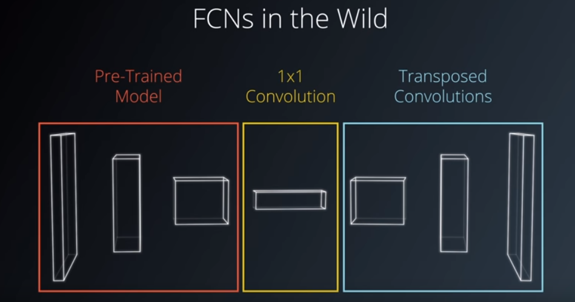
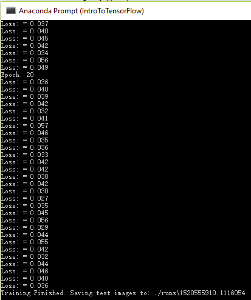
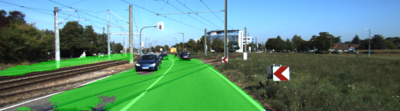
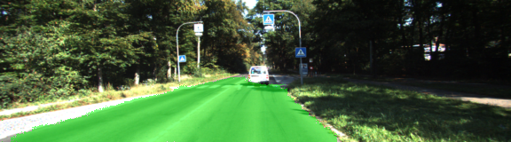
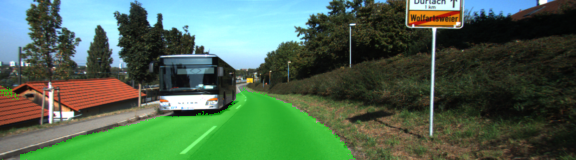
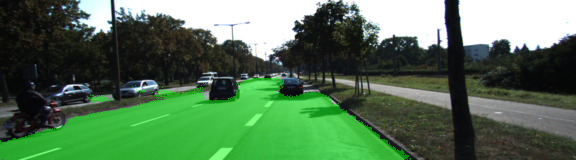
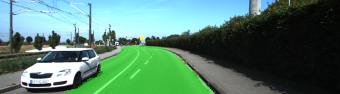
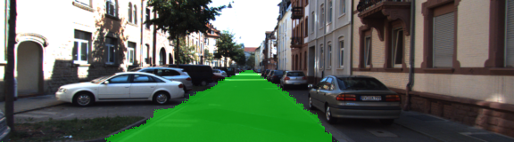
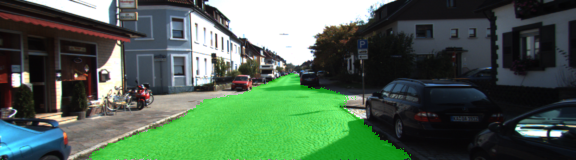

# Semantic Segmentation
### Introduction
In this project, you'll label the pixels of a road in images using a Fully Convolutional Network (FCN).

Based on the paper [Fully Convolutional Networks for Semantic Segmentation](https://people.eecs.berkeley.edu/~jonlong/long_shelhamer_fcn.pdf)



* 1- Encoder: Pre-trained VGG16 neural network
* 2- 1 x 1 convolution
* 3- Decoder: Transposed convolutions and skip connections

### Hyper-parameters
The following Hyper-parameters were used in training the FCN

| Parameter                        | Value   | 
|:--------------------------------:|:-------:| 
| Keep Probability                 | 0.5     | 
| Batch Size                       | 1       |
| Epochs                           | 20      |
| Learning Rate                    | 0.0001  |

Loss after 20 Epochs



### Samples

Below are a few sample images from the output of the fully convolutional network










### Setup
##### Frameworks and Packages
Make sure you have the following is installed:
 - [Python 3](https://www.python.org/)
 - [TensorFlow](https://www.tensorflow.org/)
 - [NumPy](http://www.numpy.org/)
 - [SciPy](https://www.scipy.org/)

### Run
Run the following command to run the project:
```
python main.py
```


 
